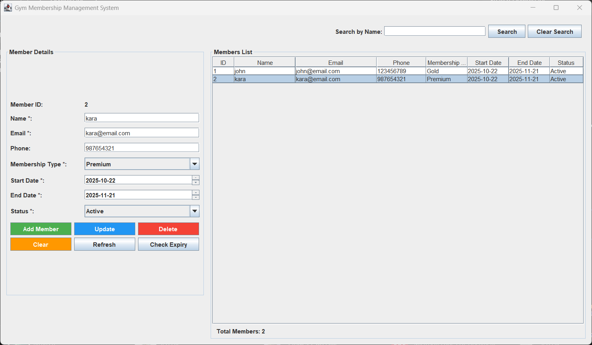
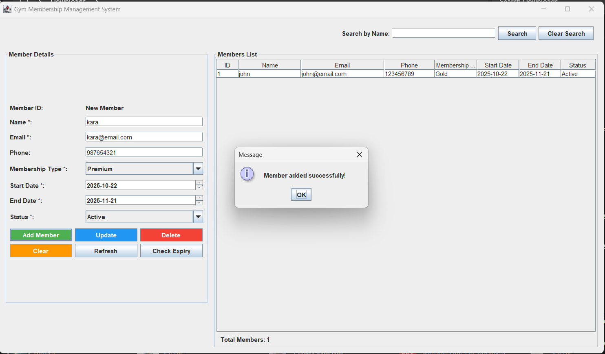
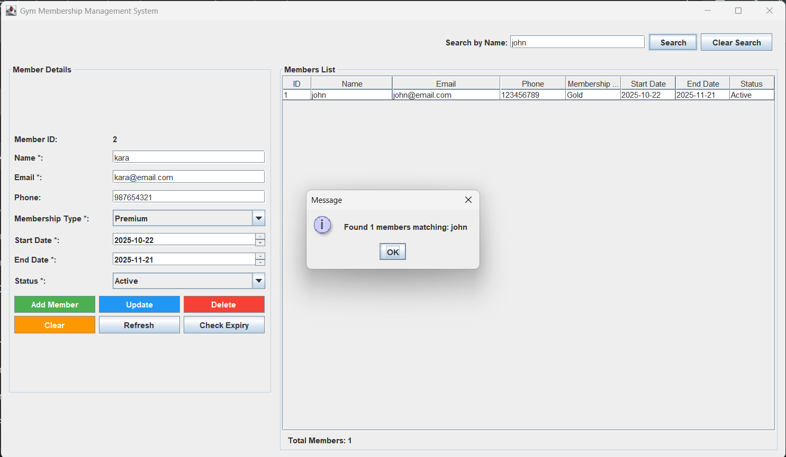
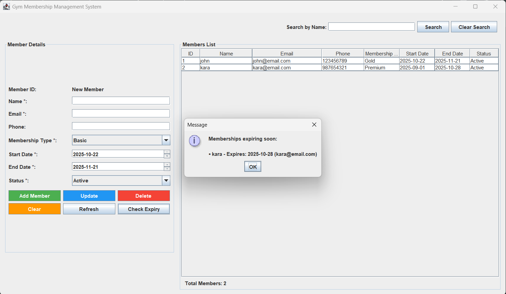

#  Gym Management System

A comprehensive Java Swing application for managing gym memberships with MySQL database integration. This system provides a user-friendly interface for gym administrators to efficiently manage member records, track membership status, and monitor expiry dates.


##  Features

-  **Complete Member Management** - Add, update, delete, and view member details
-  **Smart Search** - Search members by name with real-time results
-  **Expiry Tracking** - Automatic detection of memberships expiring soon (7-day warning)
-  **Intelligent ID System** - Consecutive ID management that fills gaps automatically
-  **Status Management** - Track Active, Expired, and Suspended memberships
-  **MySQL Integration** - Secure and reliable database storage
-  **User-Friendly GUI** - Clean and intuitive Swing interface
-  **Data Validation** - Email format, date range, and required field validation

##  Technologies Used

- **Backend**: Java 8+
- **GUI Framework**: Java Swing
- **Database**: MySQL
- **Database Connectivity**: JDBC
- **Build Tool**: Manual compilation

##  Prerequisites

Before running this application, ensure you have:

-  Java JDK 8 or higher
-  MySQL Server 5.7 or higher
-  MySQL Connector/J (included in lib folder)

##  Quick Start
##  Application Screenshots

### Main Interface

*Main application window showing member list and management controls*

### Add Member Form

*Form for adding new gym members with validation*

### Search Feature

*Real-time search functionality by member name*

### Expiry Checking

*Membership expiry detection and alerts*
### 1. Database Setup
```sql
CREATE DATABASE gym_management;
USE gym_management;

CREATE TABLE members (
    id INT AUTO_INCREMENT PRIMARY KEY,
    name VARCHAR(255) NOT NULL,
    email VARCHAR(255) NOT NULL UNIQUE,
    phone VARCHAR(20),
    membership_type VARCHAR(50),
    start_date DATE,
    end_date DATE,
    status VARCHAR(20)
);
